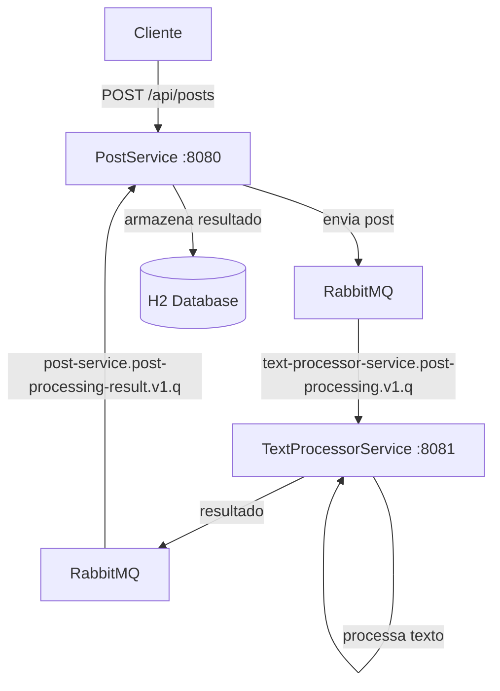

# AlgaPosts Microservices

Um sistema distribuído de publicação e processamento de posts construído com Spring Boot, que processa o conteúdo dos posts de forma assíncrona através de comunicação via RabbitMQ.

[](https://openjdk.java.net/projects/jdk/21/)
[](https://spring.io/projects/spring-boot)
[](https://www.rabbitmq.com/)

## 🏗️ Arquitetura do Sistema



### Microsserviços

| Serviço | Porta | Responsabilidade |
|---------|-------|------------------|
| **PostService** | 8080 | Gerencia CRUD de posts e orquestração do processamento |
| **TextProcessorService** | 8081 | Processa conteúdo dos posts (contagem de palavras e cálculo) |

**Comunicação**: Mensageria assíncrona via RabbitMQ

## ✨ Funcionalidades

- 📝 **Criação de Posts**: Criação de novos posts com título, corpo e autor
- 🔄 **Processamento Assíncrono**: Análise de conteúdo em segundo plano
- 📊 **Análise de Texto**: Contagem de palavras e cálculo de valor estimado
- 🔍 **Consulta**: Busca por ID e listagem paginada
- ⚡ **Resilência**: Dead Letter Queues para tratamento de falhas

## 🛠️ Stack Tecnológica

- **Java 21** - Linguagem de programação
- **Spring Boot 3.x** - Framework principal
- **RabbitMQ** - Message Broker para comunicação assíncrona
- **H2 Database** - Banco de dados em memória
- **Jackson** - Serialização JSON
- **Gradle** - Gerenciador de dependências

## 🚀 Início Rápido

### Pré-requisitos

- ☕ JDK 21+
- 🐘 Gradle 7.x+
- 🐰 RabbitMQ 3.x+
- 🔧 Git

### Instalação e Execução

1. **Clone o repositório**
```bash
git clone --recurse-submodules git@github.com:apelisser/algaposts.git algaposts
cd algaposts/microsservices
```

2. **Inicie o RabbitMQ**
```bash
docker compose up -d
```
> 🌐 Management UI: http://localhost:15672 (guest/guest)

Para encerrar o RabbitMQ:
```bash
docker compose down
```

3. **Inicie o TextProcessorService**
```bash
cd text-processor-service
./gradlew bootRun
```

> 🌐 Serviço disponível em: http://localhost:8081

4. **Inicie o PostService** (novo terminal)
```bash
cd post-service
./gradlew bootRun
```

> 🌐 Serviço disponível em: http://localhost:8080

### Verificação Rápida

#### Teste de criação de post
```bash
curl -X POST http://localhost:8080/api/posts \
  -H "Content-Type: application/json" \
  -d '{
    "title": "Meu Primeiro Post",
    "body": "Este é o conteúdo do meu primeiro post no sistema AlgaPosts. Aqui temos várias palavras para teste.",
    "author": "Fulano de Tal"
  }'
```

#### Listar posts
```bash
curl http://localhost:8080/algaposts/api/posts
```

#### Buscar post específico
```bash
curl http://localhost:8080/algaposts/api/posts/{post-id}
```

## 📖 Documentação da API

### 📝 PostService (porta 8080)

#### Criar Post
```http
POST /algaposts/api/posts
Content-Type: application/json

{
  "title": "Título do post",
  "body": "Conteúdo completo do post",
  "author": "Nome do autor"
}
```

**Resposta:**
```json
{
  "id": "123e4567-e89b-12d3-a456-426614174000",
  "title": "Título do post",
  "body": "Conteúdo completo do post",
  "author": "Nome do autor",
  "wordCount": 15,
  "calculatedValue": 1.5
}
```

**Códigos de Status:**
- `201 Created` - Post criado com sucesso
- `400 Bad Request` - Dados inválidos

#### Buscar Post
```http
GET /algaposts/api/posts/{id}
```

**Respostas:**
- `200 OK` - Post encontrado
- `404 Not Found` - Post não existe

#### Listar Posts
```http
GET /algaposts/api/posts?page=0&size=10
```

**Resposta:**
```json
{
  "page": 0,
  "size": 10,
  "totalElements": 45,
  "totalPages": 5,
  "content": [
    {
      "id": "123e4567-e89b-12d3-a456-426614174000",
      "title": "Título do post",
      "summary": "Primeiras três linhas do conteúdo...",
      "author": "Nome do autor"
    }
  ]
}
```

## 🔄 Fluxo de Processamento

### Estrutura das Mensagens

#### Mensagem para Processamento
**Fila**: `text-processor-service.post-processing.v1.q`
```json
{
  "postId": "123e4567-e89b-12d3-a456-426614174000",
  "postBody": "Conteúdo do post para processamento"
}
```

#### Resultado do Processamento
**Fila**: `post-service.post-processing-result.v1.q`
```json
{
  "postId": "123e4567-e89b-12d3-a456-426614174000",
  "wordCount": 25,
  "calculatedValue": 2.5
}
```

### Regras de Processamento

- **Contagem de Palavras**: Conta todas as palavras no campo `body`
- **Valor Calculado**: `wordCount * $0.10`
- **Resumo**: Primeiras 3 linhas do conteúdo do post

## ⚙️ Configurações e Validações

### Validações dos Posts

- **title**: Obrigatório, não pode estar vazio
- **body**: Obrigatório, deve conter texto não vazio
- **author**: Obrigatório, não pode estar vazio
- **id**: UUID gerado automaticamente

### Configuração das Filas

| Fila | Propósito | DLQ |
|------|-----------|-----|
| `text-processor-service.post-processing.v1.q` | Recebe posts para processamento | ✅ |
| `post-service.post-processing-result.v1.q` | Recebe resultados processados | ✅ |

### Tratamento de Erros

- **Dead Letter Queues**: Configuradas para ambas as filas
- **Retry Logic**: Implementado para falhas temporárias
- **Logs**: Registram todas as operações de mensageria

## 🏃‍♂️ Fluxo Completo

1. **Criação**: Cliente envia POST para criar novo post
2. **Persistência**: Post é salvo no banco H2 (sem processamento)
3. **Enfileiramento**: Post é enviado para fila de processamento
4. **Processamento**: TextProcessorService processa o conteúdo
5. **Resultado**: Resultado é enviado de volta via fila
6. **Atualização**: PostService atualiza o post com dados processados
7. **Consulta**: Cliente pode consultar post com dados completos
